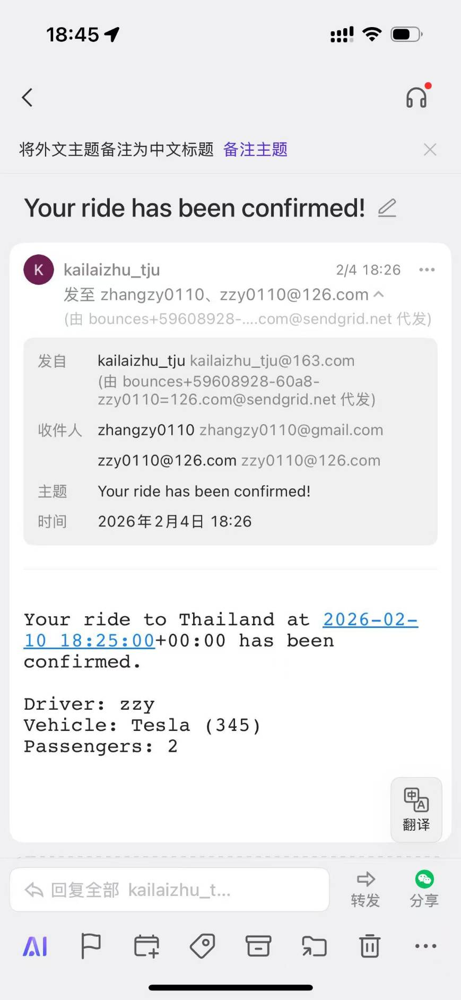

# Mock Uber Deployment Guide

This project is fully containerized using Docker. Follow the instructions below to build and run the application on a Duke Virtual Common Computing Manager (VCM) or any Linux environment.

## Prerequisites
Ensure you have the following installed on your machine:
   * Docker
   * Docker Compose

## Quick Start
Navigate to the project root directory (where docker-compose.yml is located) and run the following:
   1. chmod +x ./web-app/*.sh (**To ensure all scripts are executable before starting**)
   2. sudo docker-compose up (**Build and start all services**) \
   **Note on Startup Logs: You may see a few connection errors from the web container in the first few seconds (e.g., OperationalError or name resolution failure). This is expected as the database container takes longer to initialize. Django will automatically retry and connect once the database is ready.*

## Critical Configuration (Duke VCM)
To ensure the application works correctly in the Duke VM environment, verify the following in ./web-app/MockUber/settings.py:
   * ALLOWED_HOSTS: Must include your VM's hostname (e.g., 'vcm-51593.vm.duke.edu').
   * CSRF_TRUSTED_ORIGINS: Due to Django 5.x security policies, you must include the full URL protocol.
      * CSRF_TRUSTED_ORIGINS = [
         'http://< your-vcm-hostname >:8000',
         'http://< your-vcm-hostname >'
      ]

## Usage Notes
   * Access the App: Open your browser and go to http://< your-vcm-hostname >:8000/.
   * Logout Mechanism: In compliance with Django 5.x security updates, the Logout function is implemented via a POST request to prevent CSRF attacks. Please use the Logout button in the navigation bar.
   * Database Persistence: The PostgreSQL data is persisted using Docker volumes. Your data will remain even if the containers are stopped.

## Essential Management Commands
| Action | Command |
| ------ | ------- |
Start in Background | sudo docker-compose up -d
View Live Logs	| sudo docker-compose logs -f web
Stop Services | sudo docker-compose stop
Full Cleanup | sudo docker-compose down --volumes (Deletes all data/containers)
Restart Web Only | sudo docker-compose restart web (Fastest way to apply code changes)

## Email Configuration
We utilized the SendGrid API for email delivery. During testing, we observed a 100% delivery success rate when sending to 126.com addresses. However, delivery to Gmail was inconsistent, and emails to Outlook were consistently blocked or failed. This is likely because the SERVER_EMAIL was configured as a 163.com address, which may have triggered DMARC or SPF security filters on those platforms. A successful delivery example is shown below:
  
Additionally, we have implemented a console-based email backend as a fallback. This configuration is currently commented out in settings.py but serves as a reliable backup for local debugging and terminal-based verification. 

Author: Zeyuan Zhang, Leo Wei
